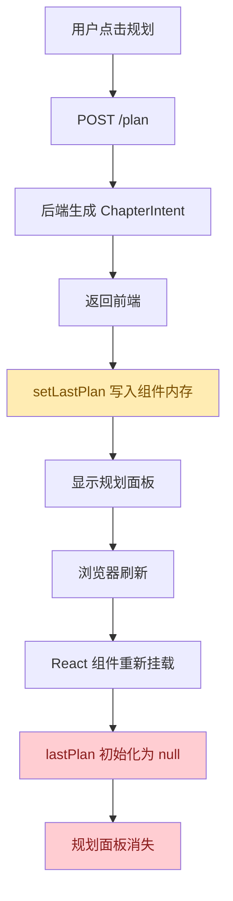
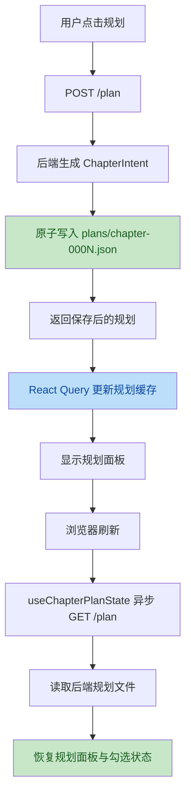

# 章节规划刷新丢失问题代码审查与设计分析

> 范围：仅分析与设计方案，不修改代码。  
> 问题：浏览器刷新后，章节“规划”功能生成的内容完全消失，包括规划内容展示、潜在规划项勾选状态和用户输入内容。

---

## 1. 结论摘要

根本原因是：**章节规划结果目前只存在前端组件内存状态中，没有进入任何可靠持久化层。**

当前 `ChapterPipeline` 在点击“规划”后，将 API 返回的 `ChapterIntent` 保存到组件内部 `lastPlan` 状态。浏览器刷新会重建 React 应用和组件树，`lastPlan` 被初始化为 `null`，因此规划面板消失。

后端 `ChapterService.plan()` 当前只生成并返回 `ChapterIntent`，没有将规划结果写入书籍数据目录；`GET /status` 也只返回章节正文状态，不返回规划结果。因此刷新后前端没有任何可重新加载规划内容的数据源。

推荐方案：**以后端受控文件持久化为主，前端查询恢复为辅，不建议使用 localStorage/sessionStorage 作为主存储。**

推荐持久化路径：

```text
books/{book_id}/plans/chapter-{chapter_no:04d}.json
```

推荐新增能力：

1. 后端保存 `ChapterIntent`；
2. 后端提供读取规划的 API；
3. 前端刷新后通过 React Query 自动加载规划；
4. 规划项勾选状态和用户输入草稿也进入同一份 planning state；
5. 保存采用原子写入；
6. localStorage 只作为可选临时草稿兜底，不作为权威数据源。

---

## 2. 现有代码审查

### 2.1 前端规划状态只存在组件内存

位置：[ChapterPipeline.tsx](file:///D:/python/Novel/storyforge3/web/src/components/chapters/ChapterPipeline.tsx#L45-L63)

关键状态：

```typescript
const [lastPlan, setLastPlan] = useState<ChapterIntent | null>(null);
```

规划运行完成后，结果只写入 `lastPlan`：

位置：[ChapterPipeline.tsx](file:///D:/python/Novel/storyforge3/web/src/components/chapters/ChapterPipeline.tsx#L94-L104)

```typescript
const value = await action();
if (isChapterIntent(value)) {
  setLastPlan(value);
}
```

规划面板渲染依赖 `lastPlan`：

位置：[ChapterPipeline.tsx](file:///D:/python/Novel/storyforge3/web/src/components/chapters/ChapterPipeline.tsx#L290-L333)

刷新后 `lastPlan` 重新变为 `null`，规划面板自然消失。

### 2.2 前端没有规划查询接口

位置：[chapters.ts](file:///D:/python/Novel/storyforge3/web/src/api/chapters.ts#L117-L120)

当前只有：

```typescript
plan: (bookId, chapterNo) => api.post<ChapterIntent>(`/api/books/${bookId}/chapters/${chapterNo}/plan`, {})
```

没有：

```typescript
getPlan(bookId, chapterNo)
```

因此刷新后无法从后端恢复规划。

### 2.3 React Query 只缓存状态，不持久化规划

位置：[useChapters.ts](file:///D:/python/Novel/storyforge3/web/src/hooks/useChapters.ts#L33-L46)

`useChapterPlan()` 是 mutation。mutation 成功后只 invalidate chapter status：

```typescript
onSuccess: (_result, variables) =>
  queryClient.invalidateQueries({ queryKey: chapterStatusKey(bookId, variables.chapterNo) })
```

这会刷新章节状态，但不会保存 `ChapterIntent`，也不会建立规划查询缓存。

### 2.4 后端 plan 不落盘

位置：[chapter_service.py](file:///D:/python/Novel/storyforge3/src/storyforge3/services/chapter_service.py#L73-L80)

当前逻辑：

```python
async def plan(self, book_id: str, chapter_no: int) -> ChapterIntent:
    template = self.prompt_registry.get_latest("plan")
    prompt = self.prompt_registry.render_system_prompt(template, chapter_no=chapter_no)
    payload = {"book_id": book_id, "chapter_no": chapter_no, "context": self.storage.read_text(self.paths.context(book_id)) or ""}
    outline = await self.llm.generate_text("chapter_plan", prompt, payload, model=self.config.model_for_task("planner"))
    goal = self._extract_goal(outline)
    return ChapterIntent(chapter_no, goal, outline_node=outline)
```

它只返回内存对象，没有调用 `storage.write_json()`。

### 2.5 后端 status 不返回规划

位置：[chapter_service.py](file:///D:/python/Novel/storyforge3/src/storyforge3/services/chapter_service.py#L220-L224)

```python
async def get_status(self, book_id: str, chapter_no: int) -> ChapterResult | None:
    text = self.storage.read_text(self.paths.chapter_file(book_id, chapter_no))
    if text is None:
        return None
    return ChapterResult(book_id, chapter_no, self._workflow_status(book_id, chapter_no), f"第{chapter_no}章", text)
```

`ChapterResult` 只表示章节文本状态，不包含规划内容。

### 2.6 当前 localStorage/sessionStorage 与规划无关

代码中已有少量浏览器存储：

- `localStorage`：更新提示、专注模式；
- `sessionStorage`：Tauri 启动错误；
- `beforeunload`：Tauri 事件解绑。

这些都不参与章节规划数据保存。

---

## 3. 根本原因分析

### 3.1 直接原因

`lastPlan` 是 React 组件状态。刷新页面后组件重新挂载，状态丢失。

### 3.2 设计原因

规划结果没有被建模为书籍受控数据。

当前系统已经把正文、世界观、角色、卷纲、truth、导出等作为持久化数据管理，但章节规划仍被当作一次性 UI 结果，导致：

- Web 刷新丢失；
- Tauri 重启丢失；
- MCP/Agent 调用无法读取前端规划状态；
- draft 不一定复用用户刚看到的计划；
- 规划勾选状态无法跨会话保存；
- 无法追踪“计划版本”和“草稿是否基于该计划”。

### 3.3 页面生命周期事件无法根治

使用 `beforeunload` 或 `unload` 做保存不是可靠方案。

原因：

1. 浏览器不保证异步请求完成；
2. `unload` 在现代浏览器中限制较多；
3. 刷新、关闭、崩溃、移动端后台切换都可能绕过完整保存；
4. 用户每次输入后都等到离开页面才保存，风险过高；
5. 多入口调用时，Agent/MCP 不会触发浏览器生命周期。

页面生命周期最多用于“最后一次同步刷新”或提示未保存，不应作为权威持久化机制。

---

## 4. 存储机制选择

### 4.1 localStorage

优点：

- 实现简单；
- 读取同步；
- 适合少量 UI 偏好或短期草稿。

缺点：

- 同步 I/O，数据大时阻塞主线程；
- 容量有限；
- 无事务；
- 无法被后端、MCP、Tauri sidecar 共享；
- 用户清浏览器数据后丢失；
- 多设备、多入口不一致。

结论：**不适合作为章节规划权威存储。**

可用作：

- 编辑中的临时草稿兜底；
- 网络失败时的最后保存副本；
- 非关键 UI 状态。

### 4.2 sessionStorage

优点：

- 标签页级隔离；
- 适合临时会话状态。

缺点：

- 标签页关闭即丢失；
- 不能满足刷新之外的长期持久化；
- 无法跨入口共享。

结论：**不适合作为规划持久化。**

### 4.3 IndexedDB

优点：

- 异步；
- 容量较大；
- 支持结构化数据；
- 可离线。

缺点：

- 实现复杂；
- 仍是浏览器本地数据，后端/MCP 不可见；
- 与当前项目“书籍目录为受控数据源”的架构不一致。

结论：**暂不需要。**

只有当未来要做离线 Web 创作、浏览器端大草稿缓存时，再考虑 IndexedDB。

### 4.4 后端受控文件存储

优点：

- 与当前 `books/{book_id}` 数据模型一致；
- Web、Tauri、MCP、Agent 都能共享；
- 可用现有 `BookStorage.write_json()` 原子写入；
- 可进入备份、快照、workspace restore；
- 便于后续 AutoDirector checkpoint/resume。

缺点：

- 需要新增 API；
- 需要前端查询加载；
- 每次勾选/输入如果都写后端，需要节流或显式保存。

结论：**推荐作为权威存储。**

---

## 5. 推荐设计方案

## 5.1 数据模型

建议新增章节规划持久化文件：

```text
books/{book_id}/plans/chapter-{chapter_no:04d}.json
```

建议结构：

```json
{
  "schema_version": 1,
  "book_id": "lurenjia",
  "chapter_no": 2,
  "intent": {
    "goal": "推进主线",
    "outline_node": "检测中心副楼出现异常回响",
    "arc_context": "林默开始主动调查",
    "must_keep": ["林默谨慎"],
    "must_avoid": ["解释设定"],
    "style_emphasis": ["短句推进"]
  },
  "checklist": {
    "must_keep": {
      "林默谨慎": true
    },
    "must_avoid": {
      "解释设定": false
    },
    "style_emphasis": {
      "短句推进": true
    }
  },
  "notes": "用户补充的规划备注",
  "source": "llm",
  "created_at": "2026-06-13T00:00:00Z",
  "updated_at": "2026-06-13T00:05:00Z"
}
```

说明：

- `intent` 保存 LLM 生成的规划；
- `checklist` 保存规划项勾选状态；
- `notes` 保存用户补充输入；
- `source` 区分 `llm`、`manual`、`agent`；
- `schema_version` 为后续迁移预留。

## 5.2 后端路径设计

建议在 `StoragePaths` 增加：

```python
def chapter_plan_file(self, book_id: str, chapter_no: int) -> Path:
    return self.book_dir(book_id) / "plans" / f"chapter-{chapter_no:04d}.json"
```

## 5.3 后端 Service 设计

建议在 `ChapterService` 中增加：

```python
async def plan(self, book_id: str, chapter_no: int) -> ChapterIntent:
    ...
    intent = ChapterIntent(...)
    self.save_plan(book_id, chapter_no, intent)
    return intent

def get_plan(self, book_id: str, chapter_no: int) -> ChapterPlanState | None:
    ...

def update_plan_state(self, book_id: str, chapter_no: int, patch: ChapterPlanPatch) -> ChapterPlanState:
    ...
```

关键要求：

1. `plan()` 生成结果后必须立刻落盘；
2. 落盘成功后再返回给前端；
3. 保存失败时 API 应返回错误，不要让用户误以为规划已保存；
4. `draft()` 如果没有显式传入 intent，应优先读取已保存 plan；
5. 若没有保存 plan，再临时生成 plan。

## 5.4 API 设计

建议新增：

```http
GET /api/books/{book_id}/chapters/{chapter_no}/plan
```

用途：读取已保存规划。不存在时返回 404 或 `data: null`。

建议新增：

```http
PATCH /api/books/{book_id}/chapters/{chapter_no}/plan
```

用途：保存勾选状态、备注、用户修改过的规划字段。

现有：

```http
POST /api/books/{book_id}/chapters/{chapter_no}/plan
```

继续表示“生成/重新生成规划”，但行为改为：

```text
LLM 生成 -> 原子写入 plan 文件 -> 返回保存后的规划
```

## 5.5 前端状态设计

建议新增 React Query：

```typescript
chapterPlanKey(bookId, chapterNo)
useChapterPlanState(bookId, chapterNo)
useGenerateChapterPlan(bookId)
useUpdateChapterPlanState(bookId)
```

`ChapterPipeline` 不再用 `lastPlan` 作为唯一数据源，而是：

```typescript
const planState = useChapterPlanState(bookId, chapterNo)
const displayedPlan = generatedPlan ?? planState.data
```

更推荐：生成成功后直接 invalidate plan query，由 query 数据驱动 UI。

规划面板展示：

- 首次加载时非阻塞；
- 不因为规划查询失败阻断章节正文渲染；
- 查询失败显示轻量错误提示；
- 没有规划时不展示面板；
- 生成规划后立即显示并保存。

## 5.6 勾选状态与输入内容保存

规划项勾选状态应当走 `PATCH /plan` 保存。

推荐策略：

- 勾选 checkbox：立即乐观更新 UI，然后后台 PATCH；
- 备注 textarea：本地防抖 500-1000ms 后 PATCH；
- 保存失败：回滚或显示“保存失败，点击重试”；
- 页面刷新：从后端重新读取最新状态。

不建议把勾选状态只存在 localStorage。

---

## 6. 原子性与可靠性设计

### 6.1 原子写入

当前 `BookStorage.write_json()` 已调用 `_atomic_write_text()`：

位置：[storage.py](file:///D:/python/Novel/storyforge3/src/storyforge3/storage.py#L60-L83)

```python
json.dumps(data, ensure_ascii=False, indent=2)
write tmp
replace target
```

规划文件应复用该机制。

写入流程：

```text
序列化完整 plan state
  -> 写入 chapter-0002.json.tmp
  -> replace chapter-0002.json
  -> 返回保存结果
```

这样可以避免只写入半份 JSON。

### 6.2 合并更新

`PATCH /plan` 不应直接覆盖整个文件，而应：

```text
读取当前 state
  -> 合并 patch
  -> 更新时间戳
  -> 原子写入完整 state
```

这样可以避免只保存 checkbox 时覆盖掉 intent 内容。

### 6.3 并发控制

基础版可以接受最后写入者胜出。更稳妥方案是增加 `revision` 或 `updated_at`：

```json
{
  "revision": 3,
  "updated_at": "..."
}
```

前端 PATCH 带上 `expected_revision`。如果后端发现版本不一致，返回 409，提示用户刷新或合并。

建议 Phase 当前先做：

- 原子写入；
- 完整 state 合并；
- 保存失败提示。

后续再加 revision 冲突检测。

---

## 7. 错误处理设计

### 7.1 后端错误

推荐错误映射：

| 场景 | HTTP | code | 用户含义 |
|---|---:|---|---|
| 规划不存在 | 404 | PLAN_NOT_FOUND | 当前章节暂无规划 |
| JSON 损坏 | 500 | PLAN_CORRUPTED | 规划文件损坏 |
| 写入失败 | 500 | PLAN_SAVE_FAILED | 规划保存失败 |
| 参数非法 | 400 | INVALID_PARAMETER | 输入内容非法 |
| 版本冲突 | 409 | PLAN_CONFLICT | 规划已被其他入口修改 |

### 7.2 前端错误

前端不应因为规划加载失败阻断章节正文显示。

建议 UI：

- 规划加载中：不显示或显示小 skeleton；
- 规划不存在：不显示规划面板；
- 规划保存失败：保留当前 UI 状态，同时显示“保存失败，点击重试”；
- 生成规划保存失败：toast error，并不展示“已保存”状态；
- PATCH 失败：标记该项未保存。

---

## 8. 页面生命周期事件建议

不建议依赖 `beforeunload`/`unload` 保存核心规划数据。

可选补充：

1. 当备注输入存在未保存变更时，在 `beforeunload` 中提示用户；
2. 对正在防抖等待保存的内容，在 `visibilitychange` 时触发一次同步保存尝试；
3. 对无法保证完成的保存，不承诺成功，只提示“仍有未保存内容”。

但核心策略仍应是：**用户每次有效修改后尽快保存到后端。**

---

## 9. 加载性能与用户体验

### 9.1 非阻塞加载

`useChapterPlanState()` 应独立于 `useChapterStatus()`。

页面渲染顺序：

```text
先渲染章节状态和正文
  -> 异步加载规划
  -> 有规划则显示面板
```

规划查询不应阻塞正文编辑器。

### 9.2 缓存策略

React Query 可配置：

```typescript
staleTime: 30_000
retry: false
```

生成/更新规划成功后：

```typescript
queryClient.invalidateQueries({ queryKey: chapterPlanKey(bookId, chapterNo) })
```

### 9.3 数据量评估

单章规划数据通常小于 10KB。后端 JSON 文件完全足够。

即使一本书 1000 章，规划文件也只是 MB 级别，适合当前项目的文件式存储。

---

## 10. 测试方案

### 10.1 后端单元测试

建议新增：

1. `test_plan_persists_chapter_intent`
   - 调用 `service.plan()`；
   - 断言 `plans/chapter-0008.json` 存在；
   - 断言 goal、outline_node、must_keep 等字段正确。

2. `test_get_plan_returns_persisted_intent`
   - 写入计划文件；
   - 调用 `service.get_plan()`；
   - 断言返回内容正确。

3. `test_draft_reuses_saved_plan_when_intent_missing`
   - 先保存规划；
   - 调用 `draft(book_id, chapter_no, intent=None)`；
   - 断言传入 LLM 的 intent 来自保存规划。

4. `test_update_plan_state_merges_checklist_without_losing_intent`
   - 写入完整 plan；
   - PATCH checklist；
   - 断言 intent 仍在。

### 10.2 API 测试

建议新增：

1. `POST /plan` 生成后可 `GET /plan` 读回；
2. `PATCH /plan` 保存 checkbox 后刷新仍存在；
3. 不存在规划时 `GET /plan` 返回明确结果；
4. 非法 patch 返回 400；
5. 保存失败可 mock 并验证错误 envelope。

### 10.3 前端测试

建议新增：

1. 刷新恢复测试
   - mock `GET /plan` 返回规划；
   - 渲染 `ChapterPipeline`；
   - 断言规划面板显示。

2. 生成规划后持久化查询更新
   - 点击“规划”；
   - mock `POST /plan`；
   - 断言 invalidate 或 UI 更新。

3. checkbox 持久化
   - 勾选 must_keep 项；
   - 断言调用 `PATCH /plan`；
   - 重新渲染后勾选状态仍在。

4. 保存失败提示
   - mock `PATCH /plan` 失败；
   - 断言错误提示显示，输入内容不丢。

5. 正文渲染不被规划查询阻塞
   - `GET /plan` pending；
   - 断言章节正文仍可见。

---

## 11. 推荐实施步骤

### P0：修复刷新丢失

1. 新增后端规划文件路径；
2. `ChapterService.plan()` 生成后保存；
3. 新增 `GET /plan`；
4. 前端新增 `useChapterPlanState()`；
5. `ChapterPipeline` 从 query 数据恢复规划面板；
6. 补后端与前端测试。

### P1：保存勾选状态和用户输入

1. 定义 `ChapterPlanState`；
2. 新增 `PATCH /plan`；
3. 规划面板支持 checkbox；
4. 备注输入防抖保存；
5. 保存失败可重试。

### P2：并发与版本控制

1. 增加 `revision`；
2. PATCH 带 `expected_revision`；
3. 冲突返回 409；
4. 前端提示用户刷新/合并。

---

## 12. Mermaid 流程图

### 12.1 当前问题流程



### 12.2 推荐修复流程



---

## 13. 最终建议

本问题不应通过 `beforeunload` 或 localStorage 临时补丁解决。它本质上是 **规划数据没有进入项目受控持久化模型**。

最佳方案是：

> 将章节规划升级为与正文、truth、卷纲同等级的书籍数据资产，由后端负责原子写入和读取；前端通过 React Query 非阻塞加载并展示；勾选状态和用户输入通过 PATCH 增量保存。

这样可以同时满足：

- 浏览器刷新后不丢；
- Tauri 重启后不丢；
- MCP/Agent 调用可见；
- AutoDirector 后续可复用；
- 保存具备原子性；
- 页面加载不被阻塞；
- 用户输入和勾选状态可追踪、可恢复。
